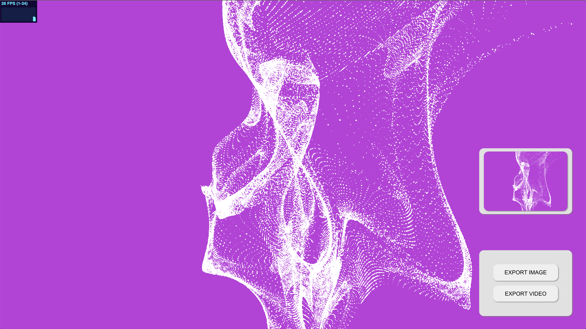

# Generative 3d Particles

A web application made with React, Threejs and GLSL to explore generative particle systems.

## Features
- Generative particle system
- Generative background color
- Soundreactive particle sizes
- Export canvas
- Preview canvas
- Responsive Resizing
- FPS monotoring

## Installation

Clone Repo.

```bash
git clone https://github.com/bernabranco/react-threejs-particles-3d.git
```
Intall Dependencies.

```bash
npm install
```

## Usage

Start application.

```bash
npm start
```

Open browser on "localhost:3000"

## Prints





